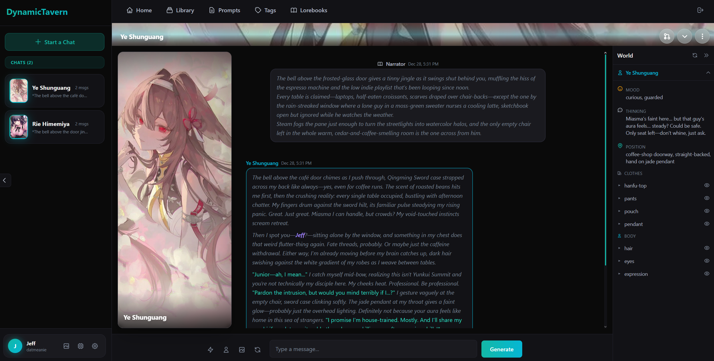

# DynamicTavern

AI-powered character chat application with multi-character scenes, dynamic world state tracking, and image generation. Create and chat with AI characters using character cards (V1/V2 format), manage multiple conversations, and configure LLM settings per-engine.

Derived from my AI chat template: https://github.com/ForgottenHistory/AI-Chat-Template

Similar RP app for a digital dating experience: https://github.com/ForgottenHistory/Cupid-AI



## Why

SillyTavern is a great project however I find it bloated yet somehow lacking features at times. I need to use various extensions from different creators spread around on discords to have a more enjoyable RP experience, which still feels "patched together" 

Likewise I tried Talemate and was blown away, though it was too complex for me to actually get into.

DynamicTavern is my take on things, simple RP chatting like SillyTavern and dynamic content like Talemate. This is my personal taste, some might agree with my decisions and some might not, that's fine. 

## Features

### World State Tracking

- **Dynamic State** - Tracks mood, position, clothes, and other attributes for characters and user
- **Auto-Generation** - Optionally regenerate world state periodically or on demand
- **Configurable Attributes** - Define what to track via `data/config/world_attributes.json`

### Character System

- **Character Cards** - Import V1/V2 character card formats with automatic image extraction from PNG metadata
- **Character Profile** - View and edit all character metadata with AI-powered rewrite functionality
- **Per-Character Image Settings** - Customize image generation per character:
  - Always-included tags (appearance)
  - Contextual tags (AI chooses based on conversation)
  - Prompt overrides

### User Identity

- **User Personas** - Create multiple personas with custom names, descriptions, and avatars for roleplay
- **Quick Persona Switching** - Switch between personas from the sidebar
- **Profile Customization** - Set display name, bio, and avatar for your default profile

### Chat Features

- **Conversation Management** - Multiple conversations per character with full message history
- **Swipes** - Generate alternative responses and swipe between them
- **Impersonate** - Generate responses as the user character
- **Reasoning Display** - View LLM reasoning/thinking when available
- **QoL Buttons** - Quick copy, regenerate, and other convenience features

### Layout & Appearance

- **Chat Layouts** - Choose between bubble style (chat app) or Discord style (full-width rows)
- **Avatar Styles** - Circle or rounded square avatars
- **Dark Theme** - Consistent dark UI throughout

### Multi-LLM Architecture

Separate LLM configurations for different purposes:

| LLM Type | Purpose |
|----------|---------|
| **Chat** | Main conversation engine |
| **Decision** | Pre-processing decisions before content |
| **Content** | Rewrites/generates character metadata, world state |
| **Image** | Generates Danbooru-style tags for image generation |

### LLM Configuration

- **LLM Presets** - Save and load LLM configurations
- **Reasoning Support** - Enable extended thinking for supported models
- **Provider Support** - OpenRouter and Featherless AI providers
- **Per-Engine Settings** - Temperature, max tokens, context window, etc.

### Image Generation

- **Stable Diffusion Integration** - Generate character images via local SD WebUI API
- **Global Tag Library** - Define tags available for AI to choose from
- **ADetailer Support** - Optional face enhancement

### Other Features

- **File-Based Prompts** - Edit system prompts through the UI or directly in `data/prompts/`
- **Logging** - View last 5 prompts/responses per LLM type for debugging

## Tech Stack

- **Framework**: SvelteKit 2 with Svelte 5
- **Language**: TypeScript
- **Styling**: Tailwind CSS 4
- **Database**: SQLite with Drizzle ORM
- **Real-time**: Socket.IO
- **LLM Providers**: OpenRouter, Featherless, NanoGPT
- **Image Generation**: Stable Diffusion WebUI API
- **Image Processing**: Sharp

## Setup

`run.bat` does this automatically on Windows.

1. Clone the repository
2. Install dependencies:
   ```bash
   npm install
   ```
3. Copy `.env.example` to `.env` and add your API keys:
   ```
   OPENROUTER_API_KEY=sk-or-v1-...
   FEATHERLESS_API_KEY=...        # optional
   SD_SERVER_URL=http://127.0.0.1:7860  # optional, for image generation
   ```
4. Initialize the database:
   ```bash
   npm run db:push
   ```
5. Start the dev server:
   ```bash
   npm run dev
   ```

As for LLMs, personally I use NanoGPT with a mix of Kimi-K2 and GLM-4.7

## Commands

```bash
npm run dev        # Start dev server
npm run build      # Production build
npm run check      # Type check
npm run db:push    # Push schema to database
npm run db:studio  # Open Drizzle Studio
```

## Inspirations

SillyTavern: https://github.com/SillyTavern/SillyTavern

Talemate: https://github.com/vegu-ai/talemate

## License

MIT
